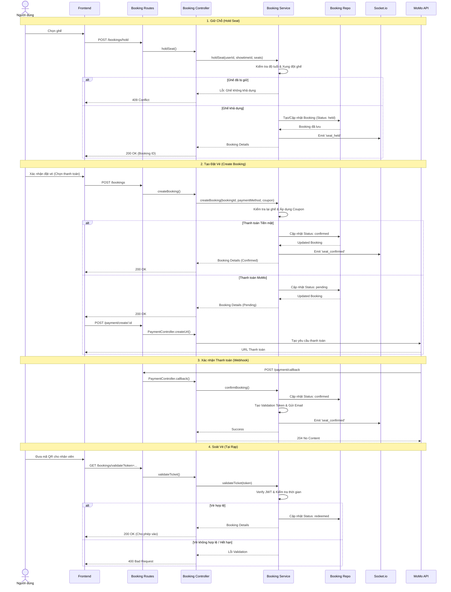

# Booking Service Workflow

The Booking Service handles the end-to-end process of reserving seats, processing payments (via MoMo or Cash), and validating tickets at the theater.

## Core States
- `held`: Temporary lock on seats (Expires in 10 minutes).
- `pending`: Booking created, awaiting payment (Expires in 15 minutes).
- `confirmed`: Payment successful or Cash booking confirmed.
- `redeemed`: Ticket has been validated and used at the theater.
- `cancelled`: Booking cancelled by user or system (timeout).

---

## 1. Seat Locking (Hold/Release)

### Hold Seat
**Endpoint:** `POST /bookings/hold`

1. **Age Check:** Service verifies if the user meets the movie's age rating.
2. **Collision Check:** Verifies if the seat is already reserved or held by another user.
3. **Manage Hold:**
    - If user has an existing `held` booking for this showtime: Adds seat to it (Max 8 seats).
    - Otherwise: Creates a new booking with status `held`.
4. **Expiration:** Sets `expiresAt` to 10 minutes from now.
5. **Socket Event:** Emits `seat_held` to the showtime room.

### Release Seat
**Endpoint:** `POST /bookings/release`

1. **Remove Seat:** Removes the specified seat from the user's active hold.
2. **Cleanup:** If no seats remain in the booking, the booking record is deleted.
3. **Socket Event:** Emits `seat_released`.

---

## 2. Booking Creation & Payment

### Create Booking
**Endpoint:** `POST /bookings`

1. **Eligibility:** Re-verifies age and seat availability.
2. **Coupons:** Validates and applies coupon codes if provided.
3. **Process Upgrade:**
    - Typically upgrades an existing `held` booking to `pending` or `confirmed`.
    - If `paymentMethod` is `cash`, status becomes `confirmed`.
    - If `paymentMethod` is `momo`, status becomes `pending`.
4. **Expirations:** 
    - `pending` bookings expire in 15 minutes.
    - `confirmed` bookings have no expiration (`null`).
5. **Validation Token:** If confirmed immediately, a JWT `validationToken` is generated.
6. **Socket Event:** If confirmed, emits `seat_confirmed`.

### Confirm Booking
**Endpoint:** `POST /bookings/:id/confirm` (MoMo Callback/Simulation)

1. **Status Update:** Updates status to `confirmed`.
2. **Finalize:**
    - Clears `expiresAt`.
    - Generates `validationToken`.
    - Sends confirmation email with QR code data.
3. **Socket Event:** Emits `seat_confirmed`.

---

## 3. Ticket Validation (Theater)

### Validate Ticket
**Endpoint:** `GET /bookings/validate?token=<JWT>`

1. **Token Verification:** Decodes JWT to get `bookingId`.
2. **Time Window Check:** 
    - Ticket is valid starting **60 minutes before** show start.
    - Ticket expires **30 minutes after** show start.
3. **Status Check:** Must be `confirmed` and not already `redeemed`.
4. **Redeem:** Updates status to `redeemed`.
5. **Response:** Returns booking details (Seats, ID) for staff verification.

---

## 4. Administrative Actions

### Manual Redeem
**Endpoint:** `POST /bookings/:id/redeem` (Staff only)
- Directly marks a `confirmed` or `paid` booking as `redeemed`.
- Creates an audit log entry.

### Search Bookings
**Endpoint:** `GET /bookings/search?query=<Email/Phone>`
- Finds users matching the query and returns their booking history.

### Cancel Booking
**Endpoint:** `POST /bookings/:id/cancel`
- Marks status as `cancelled`.
- Restores coupon usage if applicable.

---

## Data Flow Summary

| Action | API Method | Initial Status | Final Status | Key Logic |
| :--- | :--- | :--- | :--- | :--- |
| **Pick Seat** | `POST /hold` | N/A | `held` | Age Check, Collision Check |
| **Checkout** | `POST /` | `held` | `pending` | Coupon, Price Calc |
| **Pay** | `POST /confirm` | `pending` | `confirmed` | Email, Validation Token |
| **Entry** | `GET /validate` | `confirmed` | `redeemed` | Time Window Check |

## Biểu đồ tuần tự

