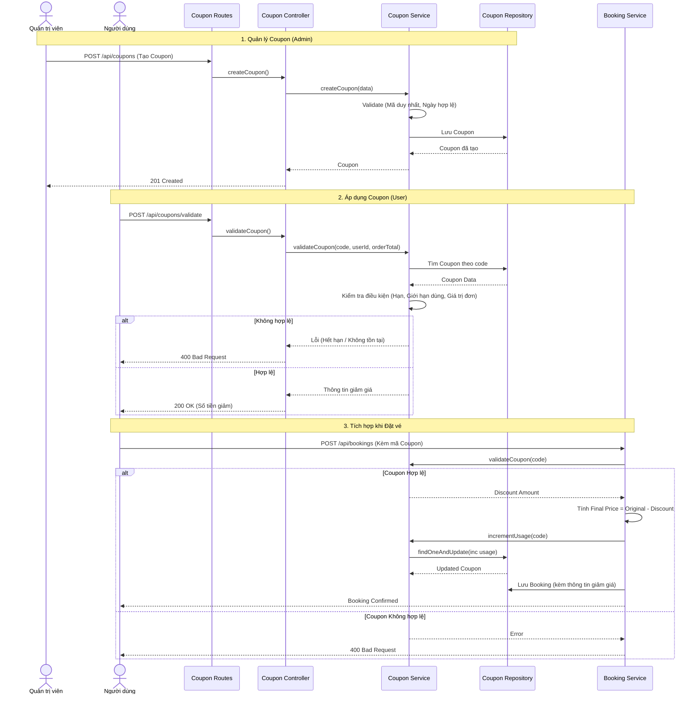

# Coupon Service Workflow

This document details the workflow for Coupon Management and Application within the Movie Ticket Booking System.

## Overview
The Coupon Service manages the lifecycle of promotional codes and validates them during the booking process. It handles both administrative management and user-facing validation.

## 1. Administrative Coupon Management

### Create Coupon
- **Operation**: `POST /api/coupons`
- **Controller**: `AdminCouponController.createCoupon`
- **Validation Points**:
    - **Route Level**: Admin authentication and authorization.
    - **Controller Level**: Required fields (code, type, value, dates).
    - **Service Level**: Code uniqueness, date range validity (start < end).
- **Result**: New coupon created in the database.

### Update Coupon
- **Operation**: `PUT /api/coupons/:id`
- **Controller**: `AdminCouponController.updateCoupon`
- **Validation Points**:
    - **Route Level**: Admin authentication and authorization.
    - **Service Level**: Existence check, date range validity.
- **Result**: Updated coupon record.

### Delete Coupon
- **Operation**: `DELETE /api/coupons/:id`
- **Controller**: `AdminCouponController.deleteCoupon`
- **Validation Points**:
    - **Route Level**: Admin authentication and authorization.
- **Result**: Coupon removed from database.

## 2. User Coupon Application

### Validate Coupon
- **Operation**: `POST /api/coupons/validate`
- **Controller**: `CouponController.validateCoupon`
- **Flow**:
    1. Check if the code exists.
    2. Verify current date is between `startDate` and `endDate`.
    3. Verify `currentUsage` < `usageLimit` (if limit set).
    4. Verify user hasn't exceeded `userUsageLimit` (checked via `BookingRepository`).
    5. Verify `orderTotal` >= `minOrderValue`.
    6. Verify `movieId` is in `applicableMovieIds` (if restricted).
- **Validation Points**:
    - **Route Level**: Authentication required (to check per-user limits).
    - **Service Level**: Expiry, usage limits, minimum order value, and movie restrictions.
- **Result**: Returns validation status and calculated `discountAmount`.

## 3. Booking Integration Workflow

### Applying Coupon during Booking
- **Operation**: `POST /api/bookings`
- **Service**: `BookingService.createBooking`
- **Flow**:
    1. If `couponCode` is provided, call `CouponService.validateCoupon`.
    2. If valid, calculate `finalPrice = originalPrice - discountAmount`.
    3. Execute atomic `CouponService.incrementUsage(code)` to prevent race conditions.
    4. Save booking with `couponCode`, `originalPrice`, and `discountAmount`.
- **Race Condition Handling**: The `incrementUsage` operation uses MongoDB's `findOneAndUpdate` with a condition `currentUsage < usageLimit` to ensure atomic limit enforcement.

### Reverting Coupon Usage
- **Operation**: `PUT /api/bookings/:id/cancel`
- **Flow**:
    1. If booking has an associated `couponCode`.
    2. Call `CouponService.decrementUsage(code)`.
    3. Update booking status to `cancelled`.
- **Result**: `currentUsage` is decremented in the coupon record.

## Data Structure

### Coupon Model
- `code`: String (Unique, Alphanumeric)
- `type`: String (ENUM: 'PERCENTAGE', 'FIXED')
- `value`: Number
- `startDate`: Date
- `endDate`: Date
- `usageLimit`: Number (Global)
- `userUsageLimit`: Number (Per-user)
- `minOrderValue`: Number
- `applicableMovieIds`: Array of ObjectIds
- `currentUsage`: Number

## Biểu đồ tuần tự

