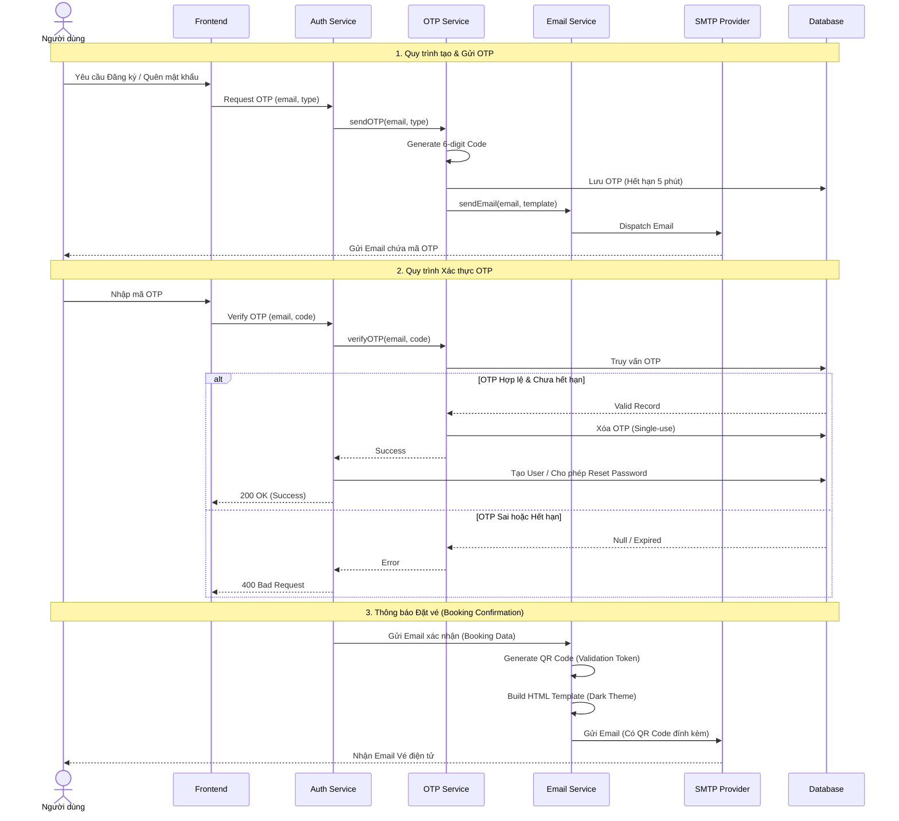

# OTP Verification & Email Notification Workflow

This document describes the implementation and workflow for the OTP-based email verification and automated booking notification system.

## 1. OTP Verification Flow

Used for User Registration and Password Reset.

### A. User Registration
1.  **Initiation:** User submits registration form on the frontend.
2.  **OTP Generation:** 
    -   Backend `AuthService` calls `OTPService.sendOTP(email, 'registration')`.
    -   `OTPService` generates a 6-digit numeric code.
    -   Saves to `OTPModel` with a 5-minute expiration.
3.  **Email Dispatch:**
    -   `OTPService` calls `EmailService.sendEmail` with the OTP template.
4.  **Verification:**
    -   Frontend prompts user for the OTP.
    -   User submits OTP to `/api/auth/verify-otp`.
    -   `OTPService.verifyOTP(email, code, 'registration')` validates existence and expiration.
5.  **Completion:**
    -   If valid, `AuthService` creates the user account in the database.

### B. Password Reset
1.  **Request:** User submits email on "Forgot Password" page.
2.  **OTP Generation:** Similar to registration, but with type `'password_reset'`.
3.  **Verification:** User submits OTP.
4.  **Action:** If valid, backend provides a temporary verification token or allows immediate password update.

---

## 2. Booking Notification Workflow

Sent automatically upon successful payment or manual booking confirmation.

### Workflow Steps
1.  **Confirmation Trigger:**
    -   In `BookingService.createBooking` (for cash payments).
    -   In `BookingService.confirmBooking` (manual confirmation by admin or payment gateway callback).
2.  **Template Generation:**
    -   `BookingService` calls `EmailTemplates.getBookingConfirmationTemplate(booking, lang)`.
    -   `EmailTemplates` generates a dark-themed HTML layout.
    -   **QR Code:** Generates a QR code image buffer from the `validationToken`.
3.  **Email Composition:**
    -   The template returns `{ html, attachments }`.
    -   The QR code is attached using a `cid:qrCodeImage` to ensure it renders inline in email clients.
4.  **Dispatch:**
    -   `EmailService.sendEmail` sends the localized email (EN/VI) to the user.

---

## 3. Technical Architecture

### Key Components
-   **OTPService:** Manages generation, storage, and validation of temporary codes.
-   **EmailService:** A wrapper around `nodemailer` using SMTP. Supports attachments and verified connections.
-   **EmailTemplates:** A central hub for HTML template generation with I18n support.
-   **QR Code Generation:** Uses the `qrcode` library to generate buffers for emails and `qrcode.react` for frontend display.

### Security Measures
-   **Single-Use OTPs:** Codes are deleted immediately after successful verification.
-   **Expiration:** OTPs expire strictly after 5 minutes.
-   **Validation Tokens:** Booking QR codes contain signed validation tokens rather than simple IDs to prevent tampering.
-   **Rate Limiting:** OTP requests are rate-limited to prevent SMTP abuse and brute-force attacks.

## 4. Localized Content
The system supports English (`en`) and Vietnamese (`vi`) for all email communication, including date formatting and currency.

## Biểu đồ tuần tự

