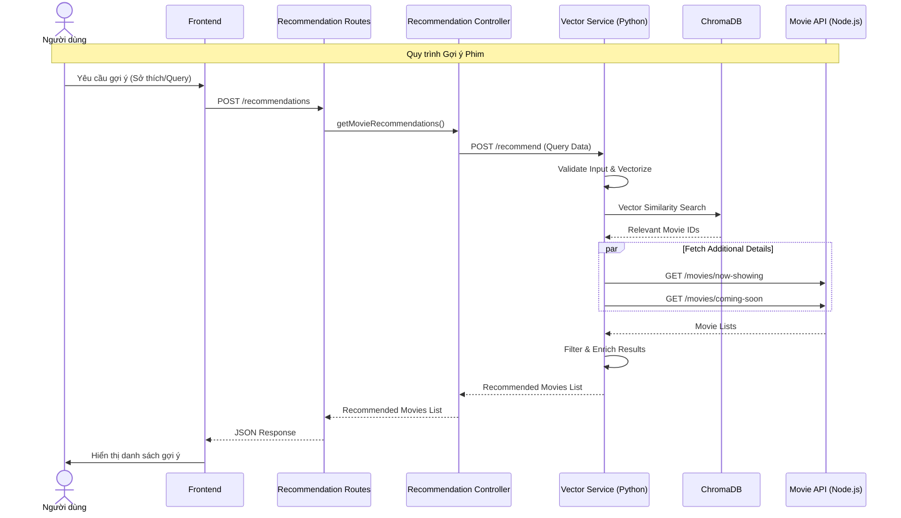

# Recommendation Service Workflow

## Get Movie Recommendations

### Actors
- Frontend (Client)
- Recommendation Routes
- Recommendation Controller
- Vector Service (Python)
- Movie API
- ChromaDB

### Workflow
1. **Frontend** sends a POST request to `/recommendations` endpoint with user preferences or query
2. **Recommendation Routes** receives the request and validates the request body format and required fields
3. **Recommendation Routes** calls the controller method `getMovieRecommendations()`
4. **Recommendation Controller** validates the recommendation query parameters and data structure
5. **Recommendation Controller** calls the service method to get movie recommendations
6. **Vector Service** validates the input query format and parameters
7. **Vector Service** makes a POST request to `/recommend` endpoint with the query data
8. **Vector Service** queries ChromaDB using vector search with the validated query
9. **ChromaDB** performs vector similarity search and returns relevant results
10. **Vector Service** receives results from ChromaDB
11. **Vector Service** fetches additional movie details from Movie API using GET `/api/movies/now-showing` and `/api/movies/coming-soon`
12. **Movie API** returns movie details to **Vector Service**
13. **Vector Service** validates and processes the recommendations
14. **Vector Service** returns the processed recommendations to **Recommendation Controller**
15. **Recommendation Controller** returns the recommendations to **Recommendation Routes**
16. **Recommendation Routes** returns the recommendations to **Frontend**

### Data Flow
- Request: POST `/recommendations` with user preferences/query
- External API Call: POST to Vector Service `/recommend`
- Vector Search: Query ChromaDB
- Additional Data Fetch: GET from Movie API for now-showing and coming-soon movies
- Response: List of recommended movies

### Validation Points
- **Recommendation Routes**: Validates request body format, content type, and presence of required fields
- **Recommendation Controller**: Validates query parameters and data structure
- **Vector Service**: Validates input query format and parameters
- **ChromaDB**: Validates vector search parameters and constraints
- **Movie API**: Validates API request parameters and authentication if required

### Success Path
- All components successfully pass data between each other
- Vector Service successfully queries ChromaDB and fetches movie details
- Frontend receives relevant movie recommendations

### Error Path
- Invalid request format results in 400 error at route level
- Invalid query parameters result in 400 error at service level
- ChromaDB connection/search errors result in 500 errors
- Movie API unavailability results in partial recommendations or 500 errors

## Biểu đồ tuần tự

