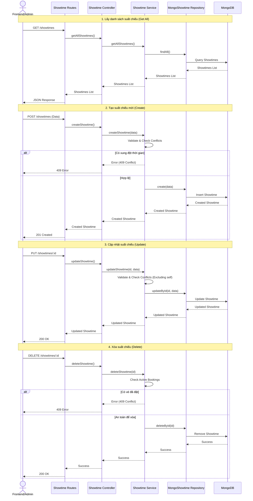

# Showtime Service Workflow

## Get All Showtimes

### Actors
- Frontend (Client)
- Showtime Routes
- Showtime Controller
- Showtime Service
- MongoShowtime Repository

### Workflow
1. **Frontend** sends a GET request to `/showtimes` endpoint with optional query parameters
2. **Showtime Routes** receives the request and validates query parameters if present
3. **Showtime Routes** calls the controller method `getAllShowtimes()`
4. **Showtime Controller** validates the request parameters (date filters, movie ID, theater ID)
5. **Showtime Controller** calls the service method `getAllShowtimes()`
6. **Showtime Service** validates business logic constraints (date ranges, filters validity)
7. **Showtime Service** calls the repository method `findAll()` to fetch showtimes from the database
8. **MongoShowtime Repository** retrieves the showtime data from the database
9. **MongoShowtime Repository** returns the showtime list to the **Showtime Service**
10. **Showtime Service** returns the showtime list to the **Showtime Controller**
11. **Showtime Controller** returns the showtime list to **Showtime Routes**
12. **Showtime Routes** returns the showtime list to **Frontend**

### Data Flow
- Request: GET `/showtimes`
- Repository Query: `findAll()`
- Response: List of showtimes

### Validation Points
- **Showtime Routes**: Validates query parameters format and type
- **Showtime Controller**: Validates parameter values (date format, movie ID format, theater ID format)
- **Showtime Service**: Validates business logic constraints (e.g., date ranges, valid filters)
- **MongoShowtime Repository**: Validates data integrity at database level

### Success Path
- All components successfully pass data between each other
- Frontend receives the complete showtime list

### Error Path
- Invalid parameters result in appropriate error responses at validation points
- Repository errors result in service-level error handling

## Get Showtime by ID

### Actors
- Frontend (Client)
- Showtime Routes
- Showtime Controller
- Showtime Service
- MongoShowtime Repository

### Workflow
1. **Frontend** sends a GET request to `/showtimes/:id` endpoint
2. **Showtime Routes** receives the request and validates the showtime ID format in the URL
3. **Showtime Routes** calls the controller method `getShowtimeById()`
4. **Showtime Controller** validates the showtime ID parameter format
5. **Showtime Controller** calls the service method `getShowtimeById(showtimeId)`
6. **Showtime Service** validates the showtime ID format and checks showtime existence
7. **Showtime Service** calls the repository method `findById(showtimeId)` to fetch the specific showtime from the database
8. **MongoShowtime Repository** retrieves the showtime data from the database
9. **MongoShowtime Repository** returns the showtime to the **Showtime Service**
10. **Showtime Service** returns the showtime to the **Showtime Controller**
11. **Showtime Controller** returns the showtime to **Showtime Routes**
12. **Showtime Routes** returns the showtime to **Frontend**

### Data Flow
- Request: GET `/showtimes/:id`
- Repository Query: `findById(showtimeId)`
- Response: Single showtime object with details

### Validation Points
- **Showtime Routes**: Validates showtime ID format in URL path parameter
- **Showtime Controller**: Validates showtime ID parameter format and type
- **Showtime Service**: Validates showtime ID format and checks existence
- **MongoShowtime Repository**: Validates data integrity at database level

### Success Path
- All components successfully pass data between each other
- Frontend receives the requested showtime information

### Error Path
- Invalid showtime ID format results in 400 error at route level
- Showtime not found results in 404 error at service level
- Repository errors result in service-level error handling

## Create Showtime

### Actors
- Frontend (Client)
- Showtime Routes
- Showtime Controller
- Showtime Service
- MongoShowtime Repository

### Workflow
1. **Frontend** sends a POST request to `/showtimes` endpoint with showtime data (movieId, theaterId, startTime, endTime, etc.)
2. **Showtime Routes** receives the request and validates the request body format and required fields
3. **Showtime Routes** calls the controller method `createShowtime()`
4. **Showtime Controller** validates the showtime data structure and required fields
5. **Showtime Controller** calls the service method `createShowtime(showtimeData)`
6. **Showtime Service** validates showtime data format (time validity, movie existence, theater existence, etc.)
7. **Showtime Service** checks for time conflicts with existing showtimes in the same theater
8. **Showtime Service** calls the repository method `create(showtime)` to save the showtime to the database
9. **MongoShowtime Repository** creates the showtime in the database
10. **MongoShowtime Repository** returns the created showtime data to the **Showtime Service**
11. **Showtime Service** returns the showtime data to the **Showtime Controller**
12. **Showtime Controller** returns the showtime data to **Showtime Routes**
13. **Showtime Routes** returns the showtime data to **Frontend**

### Data Flow
- Request: POST `/showtimes` with showtime data
- Repository Operation: `create(showtime)`
- Response: Created showtime object with details

### Validation Points
- **Showtime Routes**: Validates request body format, content type, and presence of required fields
- **Showtime Controller**: Validates data structure and field types
- **Showtime Service**: Validates showtime data format (times, movie ID, theater ID), checks for conflicts
- **MongoShowtime Repository**: Validates data integrity at database level

### Success Path
- All components successfully pass data between each other
- Showtime is successfully created in the database
- Frontend receives the complete showtime information

### Error Path
- Invalid request format results in 400 error at route level
- Invalid showtime data format results in 400 error at service level
- Time conflicts result in 409 error at service level
- Database constraint violations result in 409/500 errors

## Update Showtime

### Actors
- Frontend (Client)
- Showtime Routes
- Showtime Controller
- Showtime Service
- MongoShowtime Repository

### Workflow
1. **Frontend** sends a PUT/PATCH request to `/showtimes/:id` endpoint with showtime update data
2. **Showtime Routes** receives the request and validates the showtime ID format and request body
3. **Showtime Routes** calls the controller method `updateShowtime()`
4. **Showtime Controller** validates the showtime ID parameter and update data structure
5. **Showtime Controller** calls the service method `updateShowtime(showtimeId, updateData)`
6. **Showtime Service** validates the showtime ID format, update data, and checks showtime existence
7. **Showtime Service** checks for time conflicts with existing showtimes in the same theater (excluding current showtime)
8. **Showtime Service** calls the repository method `updateById(showtimeId, updateData)` to update the showtime in the database
9. **MongoShowtime Repository** updates the showtime in the database
10. **MongoShowtime Repository** returns the updated showtime data to the **Showtime Service**
11. **Showtime Service** returns the updated showtime data to the **Showtime Controller**
12. **Showtime Controller** returns the updated showtime data to **Showtime Routes**
13. **Showtime Routes** returns the updated showtime data to **Frontend**

### Data Flow
- Request: PUT/PATCH `/showtimes/:id` with showtime update data
- Repository Operation: `updateById(showtimeId, updateData)`
- Response: Updated showtime object with details

### Validation Points
- **Showtime Routes**: Validates showtime ID format, request body format, and content type
- **Showtime Controller**: Validates showtime ID parameter and update data structure
- **Showtime Service**: Validates showtime ID format, update data format, checks existence and time conflicts
- **MongoShowtime Repository**: Validates data integrity at database level

### Success Path
- All components successfully pass data between each other
- Showtime is successfully updated in the database
- Frontend receives the updated showtime information

### Error Path
- Invalid showtime ID or request format results in 400 error at route level
- Showtime not found results in 404 error at service level
- Time conflicts result in 409 error at service level
- Database constraint violations result in 409/500 errors

## Delete Showtime

### Actors
- Frontend (Client)
- Showtime Routes
- Showtime Controller
- Showtime Service
- MongoShowtime Repository

### Workflow
1. **Frontend** sends a DELETE request to `/showtimes/:id` endpoint
2. **Showtime Routes** receives the request and validates the showtime ID format in the URL
3. **Showtime Routes** calls the controller method `deleteShowtime()`
4. **Showtime Controller** validates the showtime ID parameter format
5. **Showtime Controller** calls the service method `deleteShowtime(showtimeId)`
6. **Showtime Service** validates the showtime ID format and checks showtime existence
7. **Showtime Service** checks for any active bookings associated with the showtime
8. **Showtime Service** calls the repository method `deleteById(showtimeId)` to delete the showtime from the database
9. **MongoShowtime Repository** deletes the showtime from the database
10. **MongoShowtime Repository** returns the deletion result to the **Showtime Service**
11. **Showtime Service** returns the result to the **Showtime Controller**
12. **Showtime Controller** returns the result to **Showtime Routes**
13. **Showtime Routes** returns the result to **Frontend**

### Data Flow
- Request: DELETE `/showtimes/:id`
- Repository Operation: `deleteById(showtimeId)`
- Response: Deletion confirmation result

### Validation Points
- **Showtime Routes**: Validates showtime ID format in URL path parameter
- **Showtime Controller**: Validates showtime ID parameter format and type
- **Showtime Service**: Validates showtime ID format, checks existence and associated bookings
- **MongoShowtime Repository**: Validates data integrity at database level

### Success Path
- All components successfully pass data between each other
- Showtime is successfully deleted from the database
- Frontend receives deletion confirmation

### Error Path
- Invalid showtime ID format results in 400 error at route level
- Showtime not found results in 404 error at service level
- Active bookings associated with showtime result in 409 error at service level
- Database constraint violations result in 409/500 errors

## Biểu đồ tuần tự

