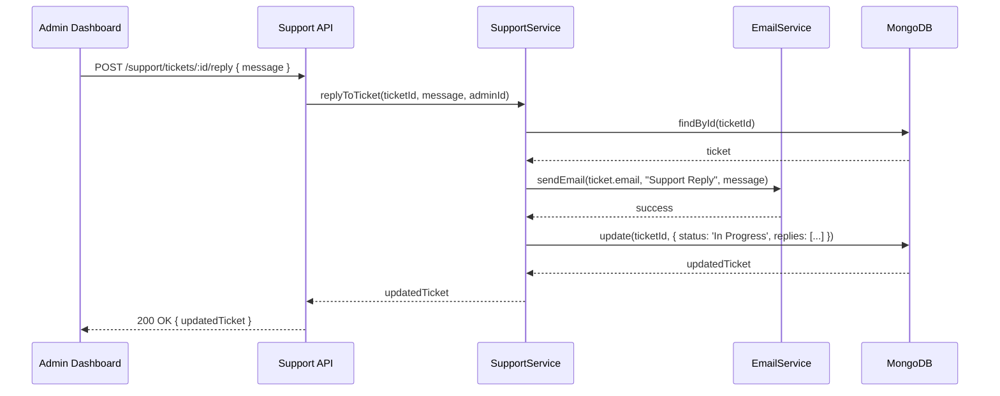

# Customer Support Admin Workflow

## Overview
The customer support system allows users to submit inquiries via a "Contact Us" form on the home page. Administrators and Staff can manage these inquiries through the Admin Dashboard. This document details the technical implementation and workflows for managing support tickets and performing administrative interventions like manual booking redemptions.

## Goals
- Streamline user communication with support staff.
- provide a centralized interface for managing user inquiries.
- Enable staff to assist users with manual booking redemption in case of technical issues with QR codes.
- Ensure high-priority issues (payment, ticketing) are addressed promptly through automated priority assignment.

## List Support Tickets

### Actors
- Admin/Staff (Frontend)
- Support Routes
- Support Controller
- Support Service
- MongoSupportTicket Repository

### Workflow
1. **Admin** navigates to the Support Management page on the Admin Dashboard.
2. **Frontend** sends a GET request to `/api/support/tickets` with the administrator's authentication token.
3. **Support Routes** authenticates the user and verifies they have the `admin` or `staff` role.
4. **Support Controller** calls `supportService.getAllTickets()`.
5. **Support Service** calls `supportTicketRepository.findAllSortedByCreatedAt()`.
6. **MongoSupportTicket Repository** queries the `SupportTickets` collection, sorting by `created_at` in ascending order (Oldest first).
7. **MongoSupportTicket Repository** returns the ticket list.
8. **Support Service** returns the tickets to the controller.
9. **Support Controller** returns the tickets as a JSON response.
10. **Frontend** displays the tickets in a table, showing status, priority, category, and user contact details.

### Sorting & Filtering
- **Sorting:** Tickets are sorted by `created_at: 1` (Oldest First) to ensure a First-In-First-Out (FIFO) response strategy.
- **Filtering:** Current implementation returns all tickets. Future enhancements include filtering by status (`Open`, `In Progress`, `Resolved`, `Closed`).

## Ticket Priority Logic

Priority is automatically assigned at the time of ticket creation based on the selected category.

### Categories and Priority Mapping
| Category | Priority |
| :--- | :--- |
| Payment Issue | High |
| Ticket/QR Problem | High |
| Account | Medium |
| General Question | Low |

### Implementation Detail
The logic is encapsulated within the `SupportService._calculatePriority(category)` method. This ensures that critical issues affecting revenue (Payment) or access (QR codes) are immediately visible to administrators with a "High" priority tag.

## Manual Booking Redemption

### Actors
- Admin/Staff (Frontend)
- Booking Routes
- Booking Controller
- Booking Service
- MongoBooking Repository
- AuditLog Repository

### Workflow
1. **Admin** searches for a booking by User Email or Phone Number.
2. **Admin** clicks the "Manual Redeem" button on a specific booking (enabled only for `paid` or `confirmed` status).
3. **Frontend** displays a confirmation dialog.
4. **Admin** confirms the action.
5. **Frontend** sends a PATCH request to `/api/bookings/:id/manual-redeem`.
6. **Booking Controller** extracts the `bookingId` and `staffId` (from auth).
7. **Booking Service** verifies the booking exists and is in a redeemable status (`paid` or `confirmed`).
8. **Booking Service** updates the status to `redeemed`.
9. **Booking Service** calls `auditLogRepository.create()` to record the intervention.
10. **MongoBooking Repository** saves the updated status.
11. **AuditLog Repository** saves the log entry (staffId, bookingId, action: 'MANUAL_REDEEM').
12. **Frontend** receives the success response and updates the UI status to 'Redeemed'.

### Data Flow
- Request: `PATCH /api/bookings/:id/manual-redeem`
- Audit Log: Created in `AuditLogs` collection for accountability.

## Reply to Ticket (Design Specification)

*Note: This workflow is currently in the design phase and represents the intended implementation for support communication.*

### Actors
- Admin/Staff (Frontend)
- Support Controller
- Support Service
- Email Service
- MongoSupportTicket Repository

### Workflow
1. **Admin** selects an "Open" or "In Progress" ticket from the list.
2. **Admin** enters a reply message in the response field and clicks "Send Reply".
3. **Frontend** sends a POST request to `/api/support/tickets/:id/reply`.
4. **Support Service** retrieves the ticket details (specifically the user's email).
5. **Support Service** calls the `EmailService.sendEmail()` to send the response directly to the user.
6. **Support Service** updates the ticket status to `In Progress` (if it was `Open`).
7. **Support Service** appends the reply to a `replies` array in the ticket document for audit purposes.
8. **MongoSupportTicket Repository** persists the changes.

### Sequence Diagram

## Resolve Ticket (Design Specification)

### Actors
- Admin/Staff (Frontend)
- Support Service
- MongoSupportTicket Repository

### Workflow
1. **Admin** determines that the user's inquiry has been fully addressed.
2. **Admin** clicks the "Resolve" button.
3. **Frontend** sends a PATCH request to `/api/support/tickets/:id/status` with `{ status: 'Resolved' }`.
4. **Support Service** validates that the ticket is not already closed.
5. **Support Service** updates the status to `Resolved`.
6. **MongoSupportTicket Repository** persists the change.
7. **Frontend** updates the list, typically hiding resolved tickets from the default view.
