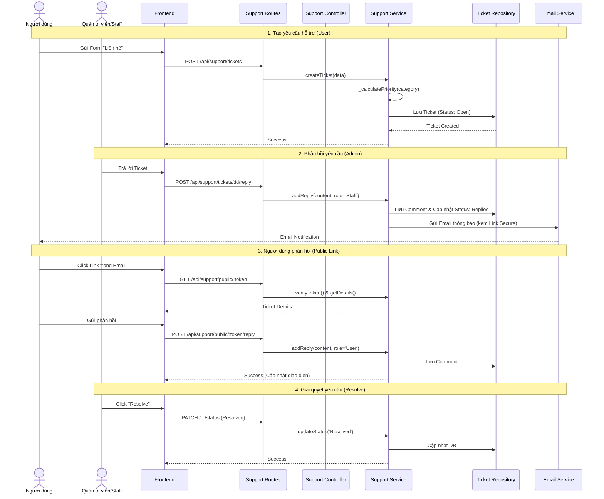

# Customer Support Admin Workflow

## Overview
The customer support system allows users to submit inquiries via a "Contact Us" form on the home page. Administrators and Staff can manage these inquiries through the Admin Dashboard. This document details the technical implementation and workflows for managing support tickets, including the email notification loop and public access for users.

## Goals
- Streamline user communication with support staff.
- Provide a centralized interface for managing user inquiries.
- Enable seamless communication via email notifications and a secure public ticket page.
- Ensure high-priority issues are addressed promptly.

## List Support Tickets

### Actors
- Admin/Staff (Frontend)
- Support Routes
- Support Controller
- Support Service
- MongoSupportTicket Repository

### Workflow
1. **Admin** navigates to the Support Management page on the Admin Dashboard.
2. **Frontend** sends a GET request to `/api/support/tickets` with the administrator's authentication token.
3. **Support Routes** authenticates the user and verifies they have the `admin` or `staff` role.
4. **Support Controller** calls `supportService.getAllTickets()`.
5. **Support Service** calls `supportTicketRepository.findAllSortedByCreatedAt()`.
6. **MongoSupportTicket Repository** queries the `SupportTickets` collection, sorting by `created_at` in ascending order (Oldest first).
7. **Support Controller** returns the tickets as a JSON response.
8. **Frontend** displays the tickets in a table, showing status, priority, category, and user contact details.

### Sorting & Filtering
- **Sorting:** Tickets are sorted by `created_at: 1` (Oldest First) to ensure a First-In-First-Out (FIFO) response strategy.

## Ticket Priority Logic

Priority is automatically assigned at the time of ticket creation based on the selected category.

### Categories and Priority Mapping
| Category | Priority |
| :--- | :--- |
| Payment Issue | High |
| Ticket/QR Problem | High |
| Account | Medium |
| General Question | Low |

### Implementation Detail
The logic is encapsulated within the `SupportService._calculatePriority(category)` method.

## Reply to Ticket

### Actors
- Admin/Staff (Frontend)
- Support Controller
- Support Service
- Email Service
- TicketComment Repository
- MongoSupportTicket Repository

### Workflow
1. **Admin** selects an "Open" or "Replied" ticket from the list to view the conversation.
2. **Admin** enters a reply message in the modal and clicks "Send Reply".
3. **Frontend** sends a POST request to `/api/support/tickets/:id/reply` with `{ content: "..." }`.
4. **Support Service** creates a new `TicketComment` document with `senderRole: 'Staff'` or `'Admin'`.
5. **Support Service** updates the `SupportTicket` status to `Replied`.
6. **Support Service** generates an email template using `EmailTemplates.getSupportReplyTemplate()`, which includes a secure access link (`/support/ticket/:token`).
7. **Support Service** calls `EmailService.sendEmail()` to notify the user.
8. **Frontend** refreshes the comment list to display the new reply.

## Public Ticket Access & User Reply

### Actors
- User (Frontend/Email)
- Support Controller
- Support Service
- MongoSupportTicket Repository

### Workflow
1. **User** receives an email notification with a "View Ticket & Reply" link.
2. **User** clicks the link, navigating to `/support/ticket/:token`.
3. **Frontend** sends a GET request to `/api/support/public/:token`.
4. **Support Service** verifies the token and returns the ticket details and comment history.
5. **User** enters a reply and clicks "Send Reply".
6. **Frontend** sends a POST request to `/api/support/public/:token/reply` with `{ content: "..." }`.
7. **Support Service** creates a new `TicketComment` document with `senderRole: 'User'`.
8. **Frontend** refreshes the conversation view.

## Resolve Ticket

### Actors
- Admin/Staff (Frontend)
- Support Service
- MongoSupportTicket Repository

### Workflow
1. **Admin** determines that the user's inquiry has been fully addressed.
2. **Admin** clicks the "Resolve" button in the ticket modal.
3. **Frontend** sends a PATCH request to `/api/support/tickets/:id/status` with `{ status: 'Resolved' }`.
4. **Support Service** updates the status to `Resolved`.
5. **MongoSupportTicket Repository** persists the change.
6. **Frontend** updates the UI to reflect the resolved status (e.g., green badge).

## Manual Booking Redemption

### Actors
- Admin/Staff
- Booking Service

### Workflow
1. **Admin** searches for a booking by User Email or Phone Number.
2. **Admin** clicks "Manual Redeem".
3. **Frontend** sends PATCH request to `/api/bookings/:id/manual-redeem`.
4. **Booking Service** verifies status (`paid`/`confirmed`), updates to `redeemed`, and logs the action in `AuditLogs`.

## Biểu đồ tuần tự

