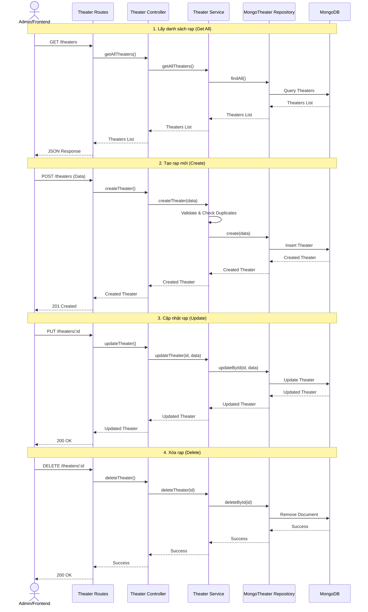

# Theater Service Workflow

## Get All Theaters

### Actors
- Frontend (Client)
- Theater Routes
- Theater Controller
- Theater Service
- MongoTheater Repository

### Workflow
1. **Frontend** sends a GET request to `/theaters` endpoint with optional query parameters
2. **Theater Routes** receives the request and validates query parameters if present
3. **Theater Routes** calls the controller method `getAllTheaters()`
4. **Theater Controller** validates the request parameters (page, limit, filters)
5. **Theater Controller** calls the service method `getAllTheaters()`
6. **Theater Service** validates business logic constraints if applicable
7. **Theater Service** calls the repository method `findAll()` to fetch theaters from the database
8. **MongoTheater Repository** retrieves the theater data from the database
9. **MongoTheater Repository** returns the theater list to the **Theater Service**
10. **Theater Service** returns the theater list to the **Theater Controller**
11. **Theater Controller** returns the theater list to **Theater Routes**
12. **Theater Routes** returns the theater list to **Frontend**

### Data Flow
- Request: GET `/theaters`
- Repository Query: `findAll()`
- Response: List of theaters

### Validation Points
- **Theater Routes**: Validates query parameters format and type
- **Theater Controller**: Validates parameter values (e.g., page >= 1, limit constraints)
- **Theater Service**: Validates business logic constraints before repository access
- **MongoTheater Repository**: Validates data integrity at database level

### Success Path
- All components successfully pass data between each other
- Frontend receives the complete theater list

### Error Path
- Invalid parameters result in appropriate error responses at validation points
- Repository errors result in service-level error handling

## Get Theater by ID

### Actors
- Frontend (Client)
- Theater Routes
- Theater Controller
- Theater Service
- MongoTheater Repository

### Workflow
1. **Frontend** sends a GET request to `/theaters/:id` endpoint
2. **Theater Routes** receives the request and validates the theater ID format in the URL
3. **Theater Routes** calls the controller method `getTheaterById()`
4. **Theater Controller** validates the theater ID parameter format
5. **Theater Controller** calls the service method `getTheaterById(theaterId)`
6. **Theater Service** validates the theater ID format and checks theater existence
7. **Theater Service** calls the repository method `findById(theaterId)` to fetch the specific theater from the database
8. **MongoTheater Repository** retrieves the theater data from the database
9. **MongoTheater Repository** returns the theater to the **Theater Service**
10. **Theater Service** returns the theater to the **Theater Controller**
11. **Theater Controller** returns the theater to **Theater Routes**
12. **Theater Routes** returns the theater to **Frontend**

### Data Flow
- Request: GET `/theaters/:id`
- Repository Query: `findById(theaterId)`
- Response: Single theater object with details

### Validation Points
- **Theater Routes**: Validates theater ID format in URL path parameter
- **Theater Controller**: Validates theater ID parameter format and type
- **Theater Service**: Validates theater ID format and checks existence
- **MongoTheater Repository**: Validates data integrity at database level

### Success Path
- All components successfully pass data between each other
- Frontend receives the requested theater information

### Error Path
- Invalid theater ID format results in 400 error at route level
- Theater not found results in 404 error at service level
- Repository errors result in service-level error handling

## Create Theater

### Actors
- Frontend (Client)
- Theater Routes
- Theater Controller
- Theater Service
- MongoTheater Repository

### Workflow
1. **Frontend** sends a POST request to `/theaters` endpoint with theater data (name, location, totalSeats, etc.)
2. **Theater Routes** receives the request and validates the request body format and required fields
3. **Theater Routes** calls the controller method `createTheater()`
4. **Theater Controller** validates the theater data structure and required fields
5. **Theater Controller** calls the service method `createTheater(theaterData)`
6. **Theater Service** validates theater data format (name length, location format, seat count validity, etc.)
7. **Theater Service** checks for duplicate theater names/locations if required
8. **Theater Service** calls the repository method `create(theater)` to save the theater to the database
9. **MongoTheater Repository** creates the theater in the database
10. **MongoTheater Repository** returns the created theater data to the **Theater Service**
11. **Theater Service** returns the theater data to the **Theater Controller**
12. **Theater Controller** returns the theater data to **Theater Routes**
13. **Theater Routes** returns the theater data to **Frontend**

### Data Flow
- Request: POST `/theaters` with theater data
- Repository Operation: `create(theater)`
- Response: Created theater object with details

### Validation Points
- **Theater Routes**: Validates request body format, content type, and presence of required fields
- **Theater Controller**: Validates data structure and field types
- **Theater Service**: Validates theater data format (name, location, seat count, etc.) and checks for duplicates
- **MongoTheater Repository**: Validates data integrity at database level

### Success Path
- All components successfully pass data between each other
- Theater is successfully created in the database
- Frontend receives the complete theater information

### Error Path
- Invalid request format results in 400 error at route level
- Invalid theater data format results in 400 error at service level
- Duplicate theater results in 409 error at service level
- Database constraint violations result in 409/500 errors

## Update Theater

### Actors
- Frontend (Client)
- Theater Routes
- Theater Controller
- Theater Service
- MongoTheater Repository

### Workflow
1. **Frontend** sends a PUT/PATCH request to `/theaters/:id` endpoint with theater update data
2. **Theater Routes** receives the request and validates the theater ID format and request body
3. **Theater Routes** calls the controller method `updateTheater()`
4. **Theater Controller** validates the theater ID parameter and update data structure
5. **Theater Controller** calls the service method `updateTheater(theaterId, updateData)`
6. **Theater Service** validates the theater ID format, update data, and checks theater existence
7. **Theater Service** calls the repository method `updateById(theaterId, updateData)` to update the theater in the database
8. **MongoTheater Repository** updates the theater in the database
9. **MongoTheater Repository** returns the updated theater data to the **Theater Service**
10. **Theater Service** returns the updated theater data to the **Theater Controller**
11. **Theater Controller** returns the updated theater data to **Theater Routes**
12. **Theater Routes** returns the updated theater data to **Frontend**

### Data Flow
- Request: PUT/PATCH `/theaters/:id` with theater update data
- Repository Operation: `updateById(theaterId, updateData)`
- Response: Updated theater object with details

### Validation Points
- **Theater Routes**: Validates theater ID format, request body format, and content type
- **Theater Controller**: Validates theater ID parameter and update data structure
- **Theater Service**: Validates theater ID format, update data format, and checks existence
- **MongoTheater Repository**: Validates data integrity at database level

### Success Path
- All components successfully pass data between each other
- Theater is successfully updated in the database
- Frontend receives the updated theater information

### Error Path
- Invalid theater ID or request format results in 400 error at route level
- Theater not found results in 404 error at service level
- Invalid update data results in 400 error at service level
- Database constraint violations result in 409/500 errors

## Delete Theater

### Actors
- Frontend (Client)
- Theater Routes
- Theater Controller
- Theater Service
- MongoTheater Repository

### Workflow
1. **Frontend** sends a DELETE request to `/theaters/:id` endpoint
2. **Theater Routes** receives the request and validates the theater ID format in the URL
3. **Theater Routes** calls the controller method `deleteTheater()`
4. **Theater Controller** validates the theater ID parameter format
5. **Theater Controller** calls the service method `deleteTheater(theaterId)`
6. **Theater Service** validates the theater ID format and checks theater existence
7. **Theater Service** calls the repository method `deleteById(theaterId)` to delete the theater from the database
8. **MongoTheater Repository** deletes the theater from the database
9. **MongoTheater Repository** returns the deletion result to the **Theater Service**
10. **Theater Service** returns the result to the **Theater Controller**
11. **Theater Controller** returns the result to **Theater Routes**
12. **Theater Routes** returns the result to **Frontend**

### Data Flow
- Request: DELETE `/theaters/:id`
- Repository Operation: `deleteById(theaterId)`
- Response: Deletion confirmation result

### Validation Points
- **Theater Routes**: Validates theater ID format in URL path parameter
- **Theater Controller**: Validates theater ID parameter format and type
- **Theater Service**: Validates theater ID format and checks existence
- **MongoTheater Repository**: Validates data integrity at database level

### Success Path
- All components successfully pass data between each other
- Theater is successfully deleted from the database
- Frontend receives deletion confirmation

### Error Path

- Invalid theater ID format results in 400 error at route level

- Theater not found results in 404 error at service level

- Database constraint violations result in 409/500 errors

## Biểu đồ tuần tự

