# Ticket Validation Workflow

This document describes the end-to-end workflow for QR code-based ticket generation and validation in the Movie Ticket Booking System.

## 1. Overview
The system generates a secure, signed token for each booking. This token is encoded into a QR code which customers present at the cinema. Staff members use their mobile devices or kiosks to scan the QR code and validate the ticket.

## 2. Sequence Diagram

```mermaid
sequenceDiagram
    participant C as Customer
    participant F as Frontend (App/Web)
    participant B as Backend API
    participant S as Staff/Kiosk (Scanner)

    Note over C, B: Booking Flow
    C->>F: Completes Booking
    F->>B: POST /api/bookings
    B-->>B: Generate validationToken (JWT signed)
    B-->>B: Create Validation URL
    B->>F: Return Booking Data + validationToken
    F->>C: Display QR Code (Validation URL)

    Note over C, S: Validation Flow
    S->>C: Scans QR Code
    S->>B: GET /api/bookings/validate?token=<token>
    Note right of B: Security Check (Auth + JWT Signature)
    B-->>B: Check Booking Status (Confirmed/Redeemed)
    alt is Valid & First Scan
        B->>B: Update Status to 'redeemed'
        B->>S: Return SUCCESS (Green UI)
    else is Already Redeemed
        B->>S: Return ERROR: Already Redeemed (Red UI)
    else is Invalid/Expired Token
        B->>S: Return ERROR: Invalid Token (Red UI)
    end
```

## 3. Key Components

### 3.1 Token Generation
- **Source:** `backend/src/application/BookingService.js` (or utility)
- **Technology:** JSON Web Token (JWT)
- **Payload:** `{ bookingId: string, exp: number }`
- **Security:** Signed with `JWT_SECRET` to prevent tampering.

### 3.2 QR Code Rendering
- **Source:** `frontend/src/pages/BookingConfirmation.jsx` and `TicketDetail.jsx`
- **Library:** `qrcode.react`
- **Content:** A full URL pointing to the validation endpoint.

### 3.3 Validation Endpoint (`GET /api/bookings/validate`)
- **Location:** `backend/src/interfaces/http/routes/bookings.js`
- **Security:**
    - **Session-based:** For staff/admin scanning via browser.
    - **Token-based:** For kiosks/API clients.
- **Content Negotiation:**
    - **JSON:** Returns status and booking metadata.
    - **HTML:** Returns a visual status indicator (Success/Failure) optimized for mobile browsers.

## 4. Redemption Logic
To prevent ticket duplication, the system implements a "Redeem Once" policy:
1. Upon successful validation of a `confirmed` booking, the status is immediately updated to `redeemed`.
2. Any subsequent attempts to validate the same token will return a `redeemed` status, indicating the ticket has already been used.
