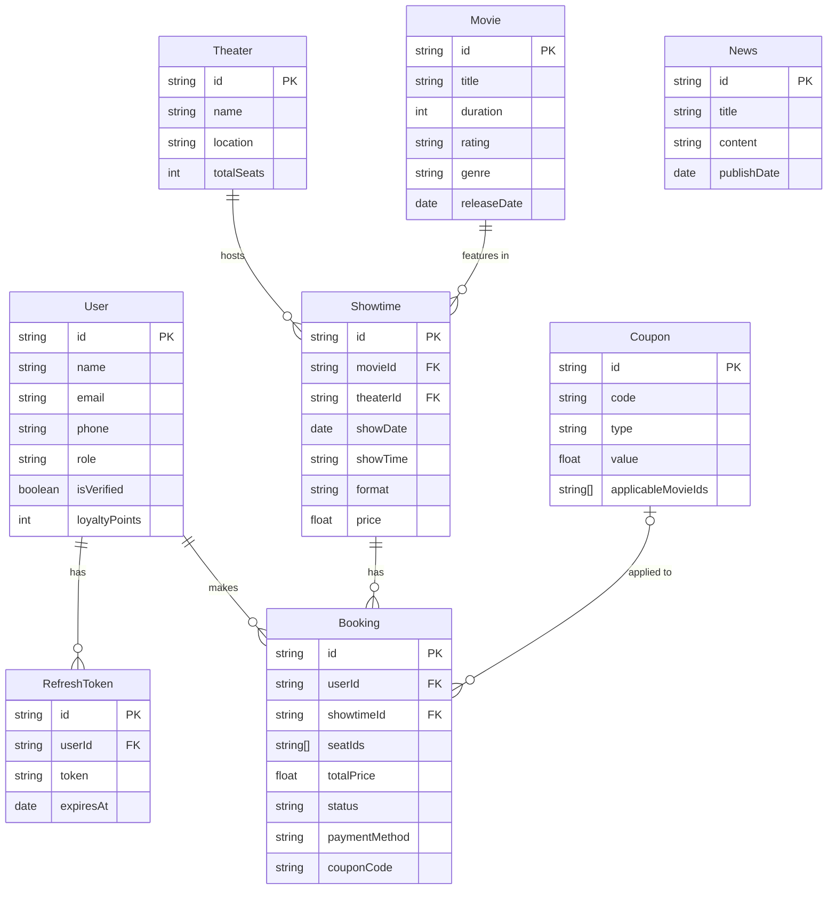

# Entity Relationship Diagram - Movie Ticket Booking System

This diagram represents the core data entities and their relationships within the system.

## Entity Descriptions

- **User**: Registered users of the system (Customer, Staff, Admin).
- **Movie**: Film information including metadata and restrictions.
- **Theater**: Physical cinema locations and their layout.
- **Showtime**: A specific screening of a movie at a theater.
- **Booking**: A reservation record linking a user to a showtime and specific seats.
- **Coupon**: Discount codes that can be applied to bookings.
- **News**: Promotional content or announcements.
- **RefreshToken**: Security tokens for maintaining user sessions.
