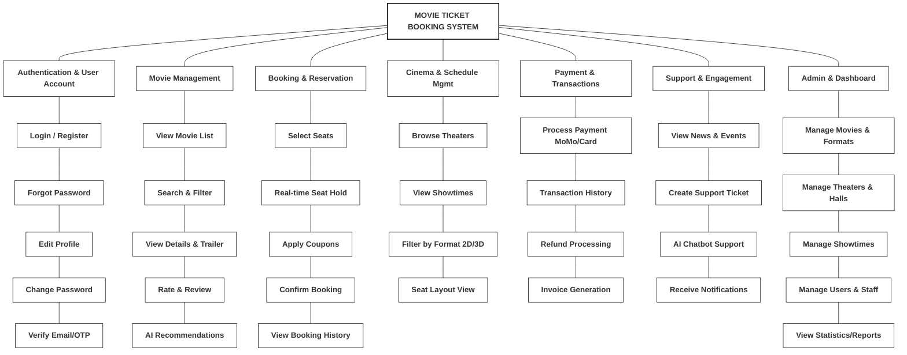

# Functional Decomposition Diagram - Movie Ticket Booking System

## Functional Hierarchy Overview

This diagram illustrates the functional breakdown of the Movie Ticket Booking System, organized by core modules and their specific capabilities:

1.  **Authentication & User Account**: Handles user identity, security, and profile management (Login, Registration, OTP Verification).
2.  **Movie Management**: Features related to browsing the movie catalog, searching, viewing details, and interacting with movie content (Ratings, Recommendations).
3.  **Booking & Reservation**: The core workflow for users to reserve tickets, including seat selection with real-time locking and coupon application.
4.  **Cinema & Schedule Mgmt**: Allows users to find theaters and view schedules (Showtimes) filtered by movie formats.
5.  **Payment & Transactions**: Manages the financial aspect, including integration with payment gateways (MoMo), history tracking, and refunds.
6.  **Support & Engagement**: Features that keep users engaged and supported, such as News, Chatbot assistance, and Support Tickets.
7.  **Admin & Dashboard**: Back-office functions for staff/admins to manage the system's data (Movies, Schedules, Theaters) and view analytics.