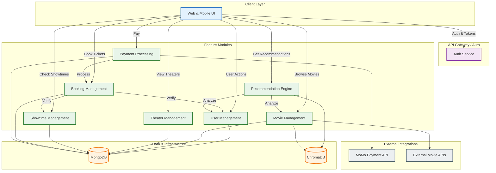

# Functional Decomposition Diagram - Movie Ticket Booking System

## System Architecture Overview

This functional decomposition diagram shows the modular architecture of the Movie Ticket Booking System:

1.  **Client Layer**: The Web & Mobile UI that interacts with users.
2.  **API Gateway / Auth**: Handles authentication and serves as the entry point for requests.
3.  **Feature Modules**: Encapsulated business logic for key domains:
    *   **User Management**: Profiles and preferences.
    *   **Movie Management**: Movie catalog and details.
    *   **Theater Management**: Theater locations and halls.
    *   **Showtime Management**: Scheduling of movies.
    *   **Booking Management**: Ticket reservation and purchase flow.
    *   **Payment Processing**: Payment transactions.
    *   **Recommendation Engine**: Personalized movie suggestions.
4.  **Data & Infrastructure**:
    *   **MongoDB**: Primary transactional database.
    *   **ChromaDB**: Vector database for recommendations.
5.  **External Integrations**: Third-party services like MoMo Payment and External Movie APIs.

The diagram illustrates the high-level interactions between the client, the consolidated feature modules, and the supporting infrastructure, emphasizing a modular and service-oriented design.
