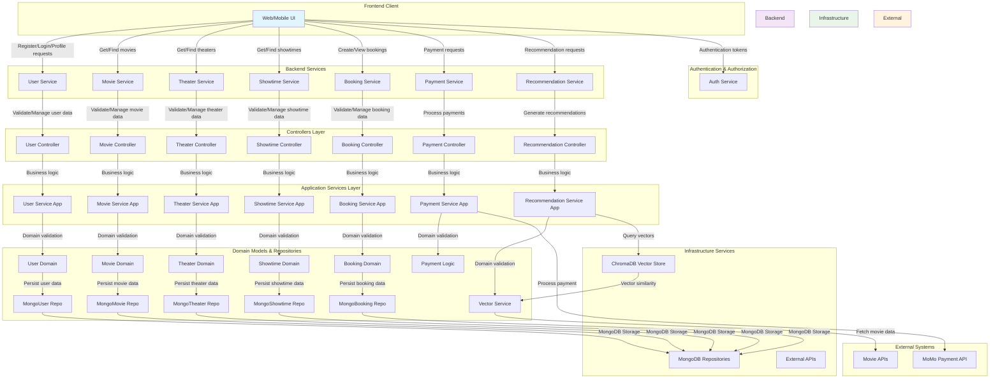

# Functional Decomposition Diagram - Movie Ticket Booking System

## System Architecture Overview

This functional decomposition diagram shows the layered architecture of the Movie Ticket Booking System:

1. **Frontend Client Layer**: The UI layer that interacts with users
2. **Backend Services Layer**: Core business services handling different domains (user, movie, theater, showtime, booking, payment)
3. **Authentication & Authorization**: Security services managing user access
4. **Controllers Layer**: Handles HTTP requests and validation
5. **Application Services Layer**: Contains business logic implementations
6. **Domain Models & Repositories**: Core business entities and data access logic
7. **Infrastructure Services**: Database storage and external services
8. **External Systems**: Third-party integrations like MoMo payment API

The diagram illustrates the flow of data and control between these various components, showing how the system handles user registration, movie browsing, theater selection, showtime scheduling, booking creation, and payment processing.